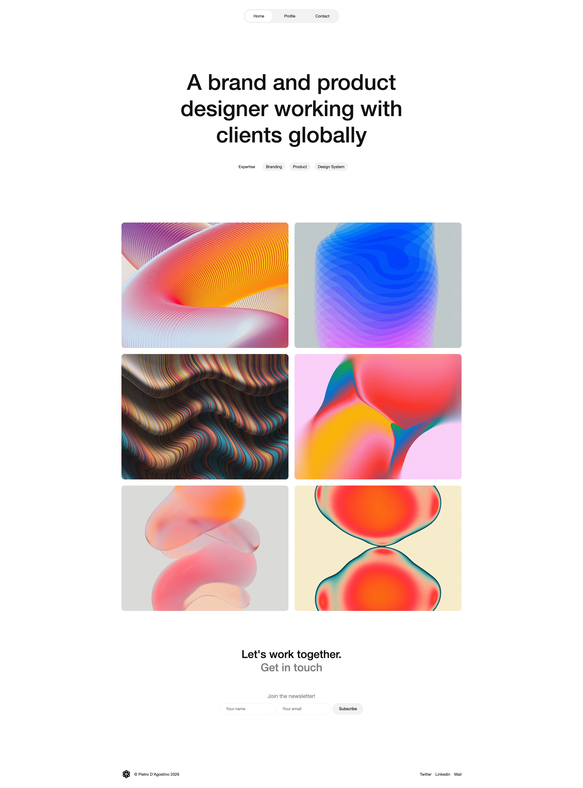

# Adaptive & Accessible Portfolio Layout — Vanilla Implementation

> Rename this title if you prefer (e.g. with your repo name).

## Description

A responsive, accessible portfolio landing page for a brand and product designer,
built as the **IT Academy Barcelona — Sprint 1** layout exercise
("Maquetació Adaptativa i Accesible — Implementació Vanilla").

The page is laid out from scratch with **vanilla HTML and CSS** (no frameworks),
following a mobile-first approach. It includes a navigation bar, a hero section,
a categories navigation, a work gallery, a call-to-action with a newsletter
sign-up form (name and email), and a footer.

This is the **vanilla iteration** of the project, developed on the
`feature/vanilla-implementation` branch.

## Preview

<!-- Take a screenshot of your page and replace the path below -->


## Project Structure

```
/
├── index.html              # Main page
├── src/
│   ├── css/
│   │   └── style.css       # CSS styles
│   └── assets/
│       └── img/            # Project images & page preview
│       └── icons/          # Project favicon & brand logo
├── recommendations/    # Best practices documentation
├── .gitignore
└── README.md
```


## Technologies Used

- **HTML5** — Semantic structure (`header`, `nav`, `main`, `section`, `footer`)
- **CSS3** — Styling and responsive design, using:
  - **CSS Grid** for the work gallery layout
  - **Flexbox** for aligning content inside the navigation and the form
  - **Relative units** (`rem`, `%`) for scalable, proportional sizing
  - **`clamp()`** for fluid typography and spacing
  - **Mobile-first** media queries

## Accessibility

- Semantic landmarks so the page structure is clear to assistive technology
- `aria-label` on the main container describing the page
- `aria-current="page"` to mark the active navigation link
- Accessible names for every form field (`aria-label`) and for the newsletter region (`aria-labelledby` pointing to its heading)
- Visible keyboard focus styles and reduced-motion support
- Color contrast checked for readability

## Installation and Execution

### Prerequisites

- A modern web browser (Chrome, Firefox, Edge, Safari)
- A code editor (recommended: VS Code)
- Git installed (optional but recommended)

### Steps to run the project

1. **Clone the repository** (or download the ZIP):
```bash
git clone https://github.com/pietrodags/it-sprint1-maquetacio.git
```

2. **Navigate to the project folder**:
```bash
cd [it-sprint1-maquetacio]
```

3. **Switch to the vanilla branch**:
```bash
git checkout feature/vanilla-implementation
```

4. **Open the page in your browser**:
   - Option 1: Double-click on `index.html`
   - Option 2: Use Live Server in VS Code (recommended)

### Using Live Server in VS Code (recommended)

1. Install the [Live Server](https://marketplace.visualstudio.com/items?itemName=ritwickdey.LiveServer) extension
2. Right-click on `index.html`
3. Select "Open with Live Server"

## Usage

Customize the project by editing:
- `index.html` — Modify content and structure
- `src/css/style.css` — Change styles and colors
- `src/assets/img/` — Add your own images

## Contributors

- **[Pietro D'Agostino]** — [https://https://github.com/pietrodags](https://https://github.com/pietrodags)

## License

This project is under the MIT License — see the [LICENSE](LICENSE) file for more details.

---

If you liked this project, give it a star on GitHub.